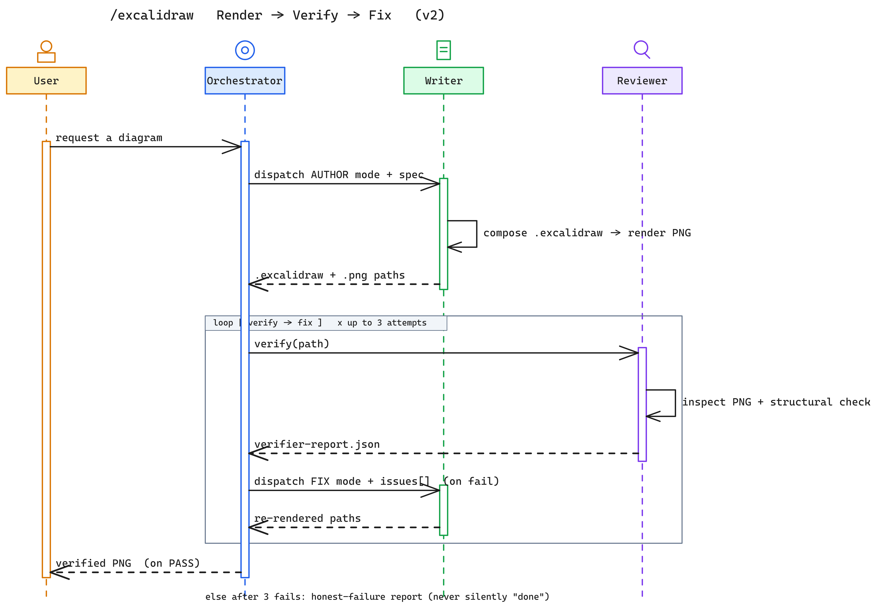
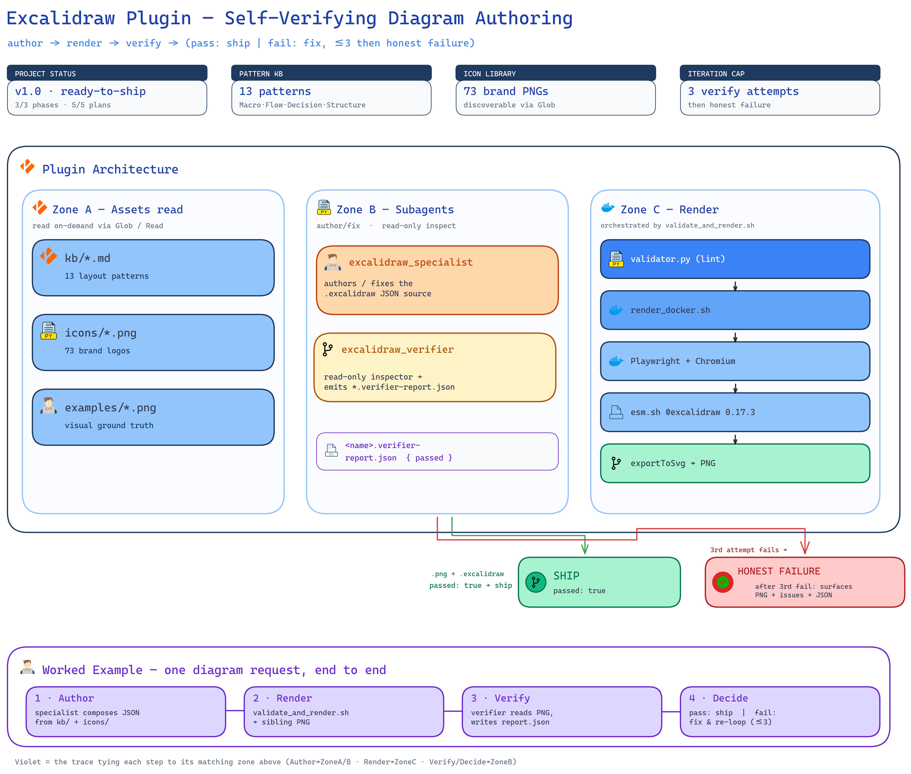
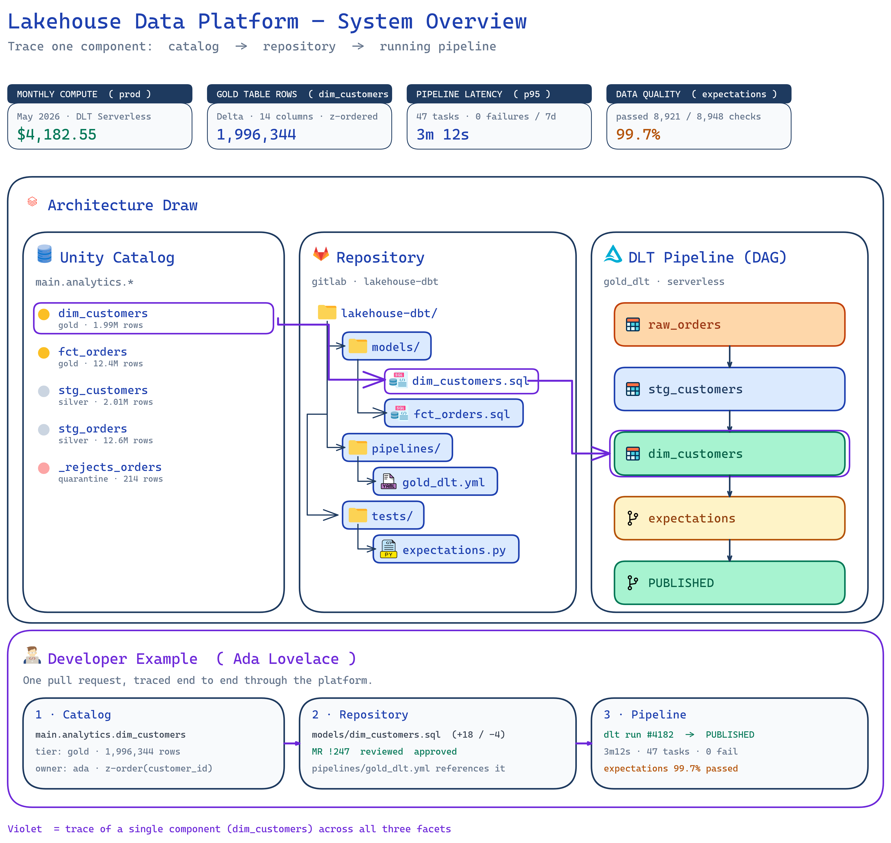
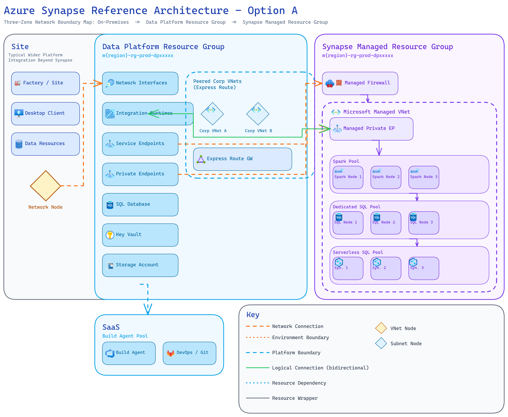
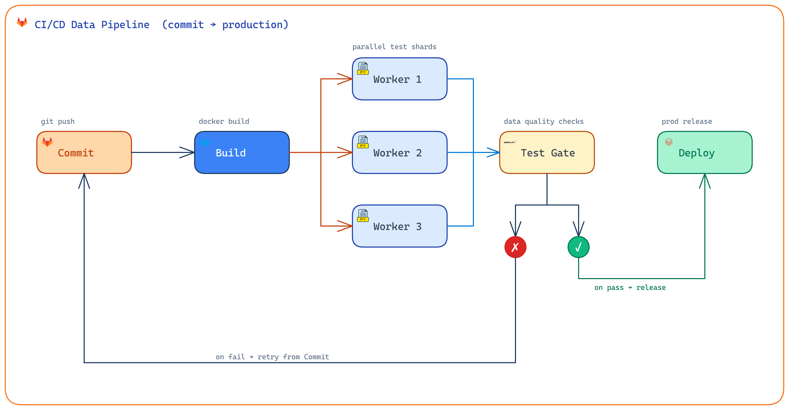
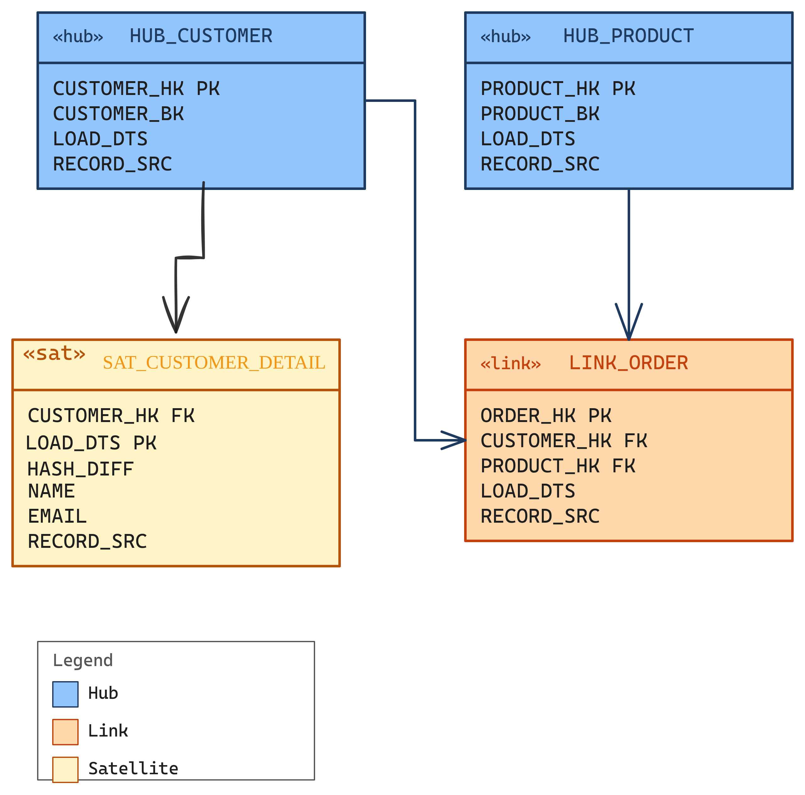
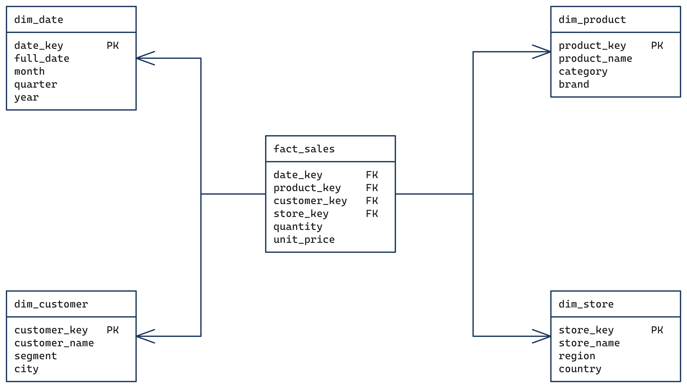
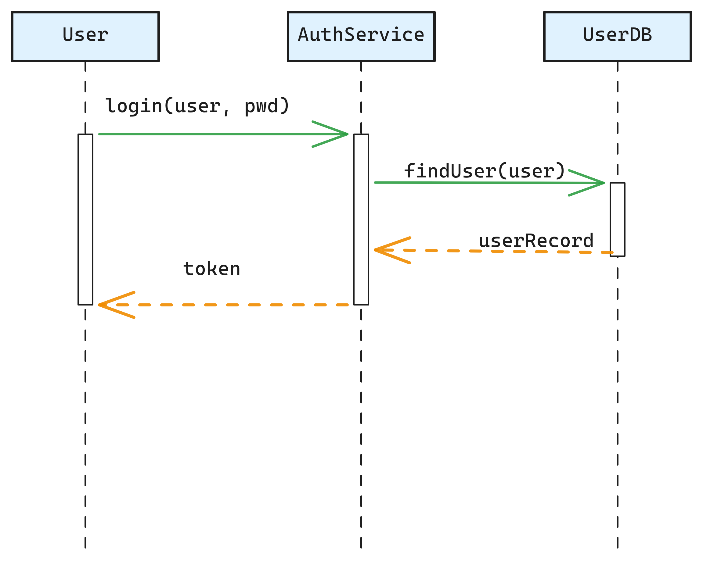
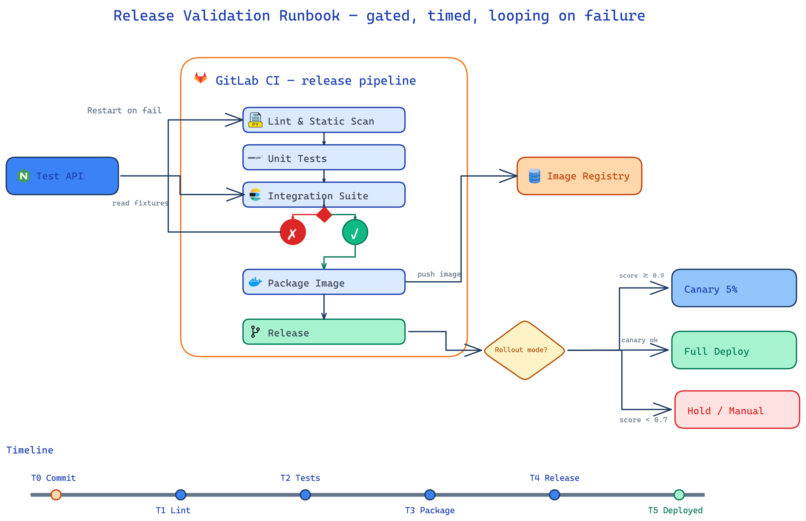

<div align="center">

# 🎨 Excalidraw Visual Architect

### A Claude Code agent that draws professional, architectural-grade technical diagrams — and verifies them before calling them done.

*Every diagram below was generated by this agent.*

</div>

---

## 👀 See it in one glance

Two diagrams — both drawn by this agent — say more than a feature list. The first shows **what it produces**; the second shows **how it produces it**.

### How it works — the self-verifying loop
> The agent drawing **itself**: a UML sequence diagram of the `/excalidraw` Render → Verify → Fix loop. User → Orchestrator → Writer → Reviewer, with the verify→fix loop (up to 3 attempts) and the honest-failure escape hatch. Notice the straight lifeline/message arrows — the one place the agent intentionally drops the default elbow arrows because a forced 90° jog on a lifeline reads as noise.




---

> ### ⚠️ Read this first — token cost
>
> This agent is built to return **accurate, professional, architecture-grade results** — not quick sketches. To get there it reads a layered knowledge base, studies reference renders as visual ground truth, writes precise Excalidraw JSON, renders it, and runs an independent verify→fix loop. **That accuracy costs a lot of tokens.** A single polished diagram can burn a meaningful chunk of your budget. That trade is deliberate: you're paying for a diagram you could put in front of an architecture review, not a throwaway. Plan your usage accordingly.

> ### 🚧 Work in progress
>
> This agent is **actively being built and improved**. Expect changes — new diagram types, refined visual standards, restructured knowledge base, and breaking tweaks to paths and conventions. If something looks different from the docs, the agent moved faster than this README.

> ### 🐳 Docker must be running
>
> The agent renders each `.excalidraw` to a PNG inside a **Docker container** (Playwright + a headless browser). **Docker has to be up and running** before you use the agent — without it, the render step fails and no images are produced. Start Docker first, then invoke the agent.

---

## 🖼️ Gallery — made by the agent

These are real outputs from the Excalidraw Visual Architect, each rendered and verified through the agent's loop.

### Tech Architecture — multi-zoom platform overview
> The canonical architecture example (shown at the top too): an evidence strip of real metrics, three branded zones wired with sharp elbow connectors, and a worked example tracing one component end to end across every facet. The reference render that anchors the agent's `tech-architecture` recipe.



### Azure Synapse Reference Architecture — three-zone network boundary map
> On-premises → data platform resource group → Synapse managed resource group, with VNets, subnets, private endpoints, a legend, and color-coded connection semantics.



### CI/CD Data Pipeline — flow with parallel shards and pass/fail gates
> Color-coded fan-out into parallel test workers, convergence into a single quality gate, inline ✗/✓ decision markers, and a feedback loop routed cleanly outside the forward flow.



<table>
<tr>
<td width="50%" valign="top">

**Data Vault — hub / link / satellite**



</td>
<td width="50%" valign="top">

**Star Schema — fact + dimensions**



</td>
</tr>
<tr>
<td width="50%" valign="top">

**UML Sequence — lifelines & activations**



</td>
<td width="50%" valign="top">

**Process & Decision — runbook with gates**



</td>
</tr>
</table>

More examples live beside their recipes in per-type subfolders under [`.claude/agents/excalidraw/kb/diagram-types/`](.claude/agents/excalidraw/kb/diagram-types/) — ER diagrams, class diagrams, snowflake schemas, use-case diagrams, and activity diagrams.

---

## ⚙️ How it works — three agents, one closed loop

The system ships as three cooperating pieces. The orchestrator drives a closed **author → render → verify → fix** loop until the diagram passes (or honestly reports failure after 3 attempts).

```
                 ┌──────────────────────────────────────────────┐
   you  ──/excalidraw──►   ORCHESTRATOR (/excalidraw command)    │
                 │   gathers intent · owns the loop · decides     │
                 └───┬───────────────┬───────────────────┬───────┘
                     │               │                   │
       (optional)    ▼               ▼                   ▼
   ┌───────────────────────┐  ┌──────────────┐   ┌──────────────┐
   │  Icon Fetcher agent   │  │   Author     │   │  Verifier    │
   │  finds / downloads     │─►│  (specialist)│──►│  read-only   │
   │  technology logos      │  │ writes JSON, │   │  inspects PNG│
   │  (local-first)         │  │ renders PNG  │◄──│  pass / fail │
   └───────────────────────┘  └──────────────┘fix└──────────────┘
```

### 1. ✍️ The Author — `excalidraw_specialist`
The writer. It reads the diagram-type recipe, composes the right layout primitives, studies the canonical reference render as visual ground truth, writes precise Excalidraw JSON, and **renders it to a PNG** (this is the step that needs Docker). It authors and fixes — it does **not** judge its own work.

### 2. 🔍 The Reviewer — `excalidraw_verifier`
A fresh-eyes, read-only reviewer. It inspects the rendered PNG and emits a structured pass/fail report — checking arrow anchoring, text overflow, image-path resolution, raw-emoji policy, and visible render defects. It never edits or re-renders; it only reports. On a failing report, the orchestrator hands the issues back to the Author to fix, then re-verifies.

### 3. 🧩 The Icon Finder — `excalidraw_icon_fetcher` *(optional)*
When you want real technology logos (Azure, AWS, Kafka, Snowflake, …), this agent resolves them: it checks the local `icons/` folder first, then downloads any missing ones from public icon sources and converts them to clean 64×64 PNGs. It returns a manifest the Author uses to place real logos in the diagram. **Optional** — skip it and the agent falls back to local icons.

### Why the orchestrator owns the loop
Claude Code subagents **cannot spawn other subagents**. So the Author can't call the Verifier itself — the loop has to live one level up, in the `/excalidraw` command, which runs in the main conversation and *can* spawn all three. It verifies after each render, hands any failing report back to the Author to fix, and only declares success on a passing verifier report.

---

## 🎯 Style: Architect's Precision

Every diagram is held to one visual standard, which is what makes the outputs read as *one* coherent style:

- **Zero Roughness** — `roughness: 0` on every element. No hand-drawn effects.
- **Monospace Typography** — `fontFamily: 3` for all text.
- **20px Grid Alignment** — no arbitrary positions.
- **90° Elbow Arrows** — structured connectors instead of diagonals.
- **Brand Consistency** — built-in icon library and a semantic color palette.

---

## 🚀 Usage

### Prerequisites
1. **Docker running** — required for the render step (PNG export). Start it first.
2. **The Excalidraw MCP server** registered with Claude Code under the name `excalidraw`.

### Via `/excalidraw` (recommended)

Type `/excalidraw [optional description]` at the prompt. The command will:

1. Ask **what kind of diagram** (architecture / data model / UML / flow).
2. Ask **how much structure you have in mind**:
   - *Propose options based on my goal (Recommended)* — agent reads the KB + examples and suggests 2–3 concrete layout candidates, you pick.
   - *I'll describe the structure* — you give the nodes, edges, and groupings.
   - *Just generate it* — agent infers everything from your description.
3. Optionally offer to **fetch technology icons** (the optional icon-finder step).
4. **Dispatch to the Author** to generate, write, and render the `.excalidraw`.
5. **Run the Verifier**; on a failing report, hand the issues back to the Author and re-verify — up to 3 attempts.
6. **Report back** the verified PNG path, patterns used, and structural choices — or an honest failure if 3 attempts didn't pass.

This is the recommended entry point precisely because the verify→fix loop only works when something orchestrates it.

### Via direct invocation (no verification)

You can invoke `excalidraw_specialist` by name. It will pick the matching primitive patterns, read the relevant reference PNG as ground truth, find icons, generate the JSON, and render it.

**Caveat:** invoked directly, the specialist is a subagent and **cannot spawn the verifier** — so you get a rendered PNG but no independent verification or auto-fix loop. For a verified diagram, always go through `/excalidraw`.

---

## 📦 Installation

### 1. Place the agent files

Choose a scope and copy **both** pieces:

| Piece | Project scope | User scope |
|---|---|---|
| Agent bundle | `<project>/.claude/agents/excalidraw/` | `~/.claude/agents/excalidraw/` |
| `/excalidraw` command | `<project>/.claude/commands/excalidraw.md` | `~/.claude/commands/excalidraw.md` |

All paths inside the agent are relative to the project working directory, so no edits are needed when cloning into a new project.

### 2. Register the Excalidraw MCP server

The agent calls `mcp__excalidraw__*` tools. Install the MCP server from [excalidraw/excalidraw-mcp](https://github.com/excalidraw/excalidraw-mcp), then register it under the server name `excalidraw`:

```bash
claude mcp add excalidraw -- <command to launch the excalidraw-mcp server>
```

### 3. Make sure Docker is running

The render pipeline (`scripts/render/`) renders the diagram to PNG inside Docker. **No Docker, no images.**

---

## 🗂️ Knowledge base

The agent's brain is a two-layer knowledge base under [`.claude/agents/excalidraw/kb/`](.claude/agents/excalidraw/kb/):

- **`kb/patterns/`** — the PRIMITIVE layer: reusable layout sub-patterns (fan-out, convergence, tree-hierarchy, …), each with geometry + JSON skeletons.
- **`kb/diagram-types/`** — the TYPE layer: **one subfolder per diagram type** (`tech-architecture/`, `star-schema/`, `sequence/`, …), each holding the recipe plus its canonical example PNG and editable `.excalidraw` source **sitting right beside it**.

A diagram *type* is a **composition of** primitives. Start at [`kb/README.md`](.claude/agents/excalidraw/kb/README.md) for the full map and the authoritative resolver table.

---

<div align="center">

*Built for Claude Code. Adapted from the Gemini-CLI Excalidraw Visual Architect.*

</div>
# excalidraw-agent-specialist
